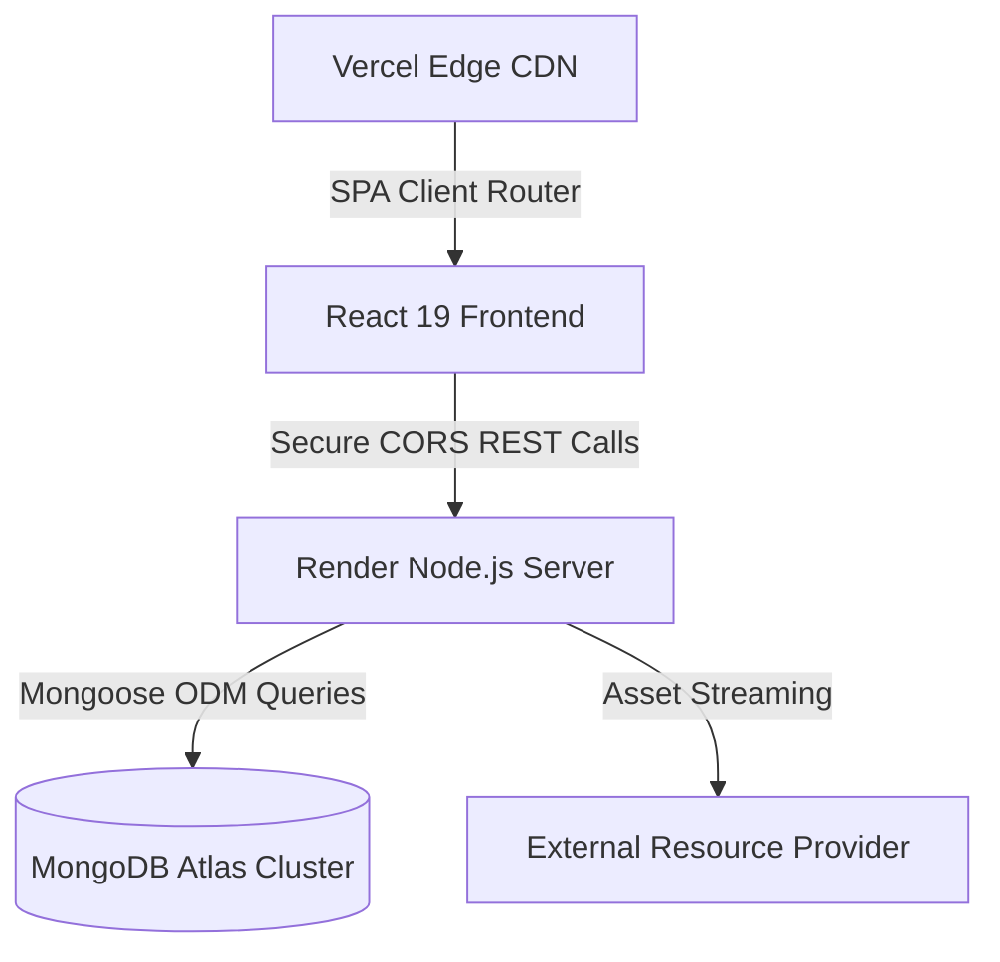

# 🤖 AI Tools Hub | Ultimate AI Directory & Comparison Matrix

[](https://ai-tools-hub-ram.vercel.app)
[](https://ai-hub-1-mkd9.onrender.com)
[](https://www.mongodb.com/cloud/atlas)
[](https://nodejs.org/)

An advanced, cloud-hosted full-stack platform designed to help developers, creators, and professionals discover, compare, and organize state-of-the-art AI tools. Built with a beautiful glassmorphic dark-theme UI and backed by a highly optimized Express.js API engine.

---

## 🎨 System Architecture



---

## ✨ Key Features

* **⚡ Interactive Compare Matrix**: Side-by-side comparison engine that allows users to evaluate any two tools in real-time by pricing model, tags, ratings, and active features.
* **🧠 Contextual AI Chatbot**: Floating chatbot (`AIChatbot.jsx`) linked to the Express backend to recommend appropriate tools depending on user prompts.
* **📂 Smart Collections & Favourites**: Users can create custom folders, save tools to specific collections, and share folders globally with unique share links.
* **🧩 Curated Themed Toolkits**: Hand-curated tool bundles tailored for specific professional roles (e.g. Copywriting, Frontend Dev, Image Art) with an overlay information panel.
* **🧭 Mobile-Optimized Grid Showcase**: 16 glassmorphic categories mapping icons with smooth hover micro-animations to completely eliminate scroll fatigue.
* **🔒 Secure Authentication & Dashboard**: Built-in user profiles, session tokens, and admin-gated moderation dashboards (`isAdmin: true`) for direct cloud tool management.
* **🖼️ Dynamic Logo Proxying**: Custom Express asset streams `/api/utils/proxy-logo` to resolve CORS/Mixed-Content blocking for external brand assets.

---

## 🛠️ Technology Stack

| Layer | Technologies |
| :--- | :--- |
| **Frontend** | React 19, Vite, TailwindCSS, Framer Motion, React Router DOM v7, Lucide Icons |
| **Backend** | Node.js, Express.js, JSON Web Tokens (JWT), Cors, Dotenv |
| **Database** | MongoDB Atlas, Mongoose ODM |
| **Hosting** | Vercel (Frontend Client), Render (API Server), MongoDB Atlas (Cloud Database) |

---

## ⚙️ Local Installation & Development

### 1. Prerequisites
* [Node.js](https://nodejs.org) (v20+ recommended)
* [MongoDB](https://www.mongodb.com/try/download/community) (Local instance or Atlas Cloud Cluster URI)

### 2. Repository Clone & Root Setup
```bash
git clone https://github.com/RambihariPatel/AI-HUB.git
cd AI-HUB
```

### 3. Backend Configuration
```bash
cd backend
npm install
```
Create a `.env` file in the `backend/` directory:
```env
PORT=5000
MONGO_URI=mongodb://localhost:27017/ai-tools-hub
JWT_SECRET=your_super_secret_jwt_key
NODE_ENV=development
```
Start local backend development server:
```bash
npm run dev
```

### 4. Frontend Configuration
```bash
cd ../frontend
npm install
```
Create a `.env` file in the `frontend/` directory:
```env
VITE_API_URL=http://localhost:5000
```
Start local frontend dev server:
```bash
npm run dev
```

### 5. Seeding Database
To populate the database with the pre-configured **156 Premium Tools** and **6 official Curated Toolkits**:
```bash
cd ../backend
npm run seed
node seedToolkits.js
```
*(Includes DNS resolver fallbacks automatically to bypass SRV resolution errors on local ISP routers).*

---

## 🚢 Cloud Deployment Configuration

### Frontend (Vercel)
* **Root Directory**: `frontend`
* **Build Command**: `npm run build`
* **Output Directory**: `dist`
* **Framework Preset**: `Vite`
* **Wildcard Rewrites**: Handles Single Page Routing (SPA) via `vercel.json` rewrite settings to prevent 404 navigation failures.

### Backend (Render)
* **Build Command**: `npm install`
* **Start Command**: `node server.js` (or configured via root `render.yaml` blueprint engine)
* **Environment Variables**: Make sure to set `MONGO_URI`, `JWT_SECRET`, and `NODE_ENV=production` in your Render dashboard environment panel.

---

## 📄 License

This project is licensed under the MIT License - see the [LICENSE](LICENSE) file for details.

---

*Built with ❤️ by [Rambihari Patel](https://github.com/RambihariPatel)*
