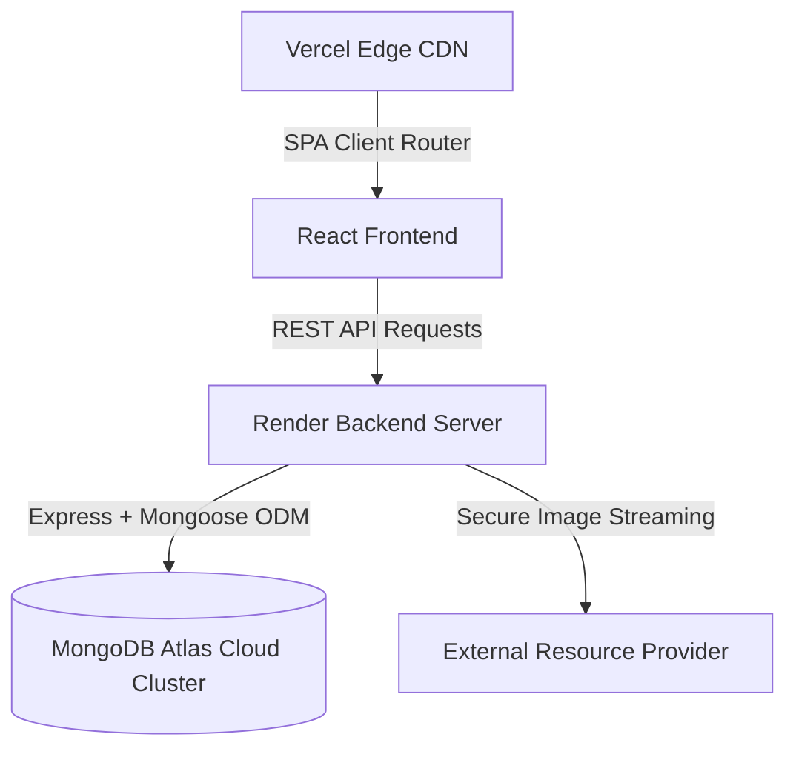
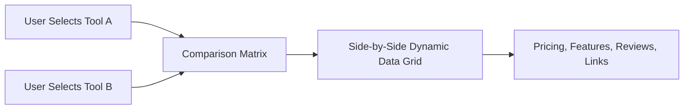

# AI Tools Hub | Technical Interview Presentation Deck
*A highly responsive, production-ready full-stack directory and comparison platform.*

---

## 🖥️ Slide 1: Project Overview & Identity
### **AI Tools Hub**
> *An advanced, cloud-hosted platform built to help developers, creators, and professionals discover, compare, and organize cutting-edge AI tools.*

* **Live Frontend**: [https://ai-tools-hub-ram.vercel.app](https://ai-tools-hub-ram.vercel.app)
* **Live API Backend**: [https://ai-hub-1-mkd9.onrender.com](https://ai-hub-1-mkd9.onrender.com)
* **Target Audience**: AI researchers, full-stack developers, content creators, and SaaS buyers.
* **Core Value Proposition**: Minimizes user decision fatigue by offering a seamless directory search, a side-by-side comparison matrix, and curated professional toolkits.

---

## 🛠️ Slide 2: Modern Full-Stack Tech Stack
### **High-Performance Architecture**

* **Frontend**: React 19, TailwindCSS, Framer Motion (micro-animations), Vite.
* **Backend**: Node.js, Express.js, JWT Authentication.
* **Database**: MongoDB Atlas (Cloud), Mongoose ODM.
* **DevOps**: GitHub-automated CI/CD pipelines deployed across Vercel (frontend hosting) and Render (backend container).

---

## 💾 Slide 3: Database & Cloud Seeding Strategy
### **Robust Data Foundations**
* **MongoDB Models**:
  * **Tool**: Title, description, URL, pricing category, tags, ratings, active logo proxy path, and category classification.
  * **Curated Toolkit**: Collection of tools tailored for specific roles (e.g., Coding, Writing, Image Art).
  * **User**: JWT credentials, role-based controls (`isAdmin`), collections, and favorites history.
* **Production Seeding**: 
  * Seeded with **156 premium tools** and **6 official curations**.
  * **Engineered ISP Resolution Override**: Overcame local DNS blocks during SRV resolution (`mongodb+srv`) by writing a custom Node DNS override pointing to Google Public DNS (`8.8.8.8`) at script level.

---

## 🎭 Slide 4: Frontend Re-engineering & UX Optimization
### **Combating Mobile Scroll Fatigue**
* **The Problem**: Initial designs flooded the home screen with 150+ cards, causing massive visual noise and slow rendering on mobile.
* **The Solution**: 
  * Re-architected Home to display top 6 trending tools for quick views.
  * Implemented a stunning **16-Category Grid Showcase** using glassmorphic hover effects, helping users navigate instantly rather than scrolling infinitely.
  * Symmetrically designed responsive column layouts for all main directories.
  * Built a reusable, premium **Responsive Footer** matching the dark-theme aesthetic, featuring social links and newsletter layout.

---

## 🔄 Slide 5: The `/compare` Page Comparison Matrix
### **Deep Decision Analysis Engine**

* **Interactive Selector**: Let's users choose any two tools from the database and compares their pricing model, tags, ratings, and features.
* **Selection Dropdown Fix**: Solved container clipping issues (`overflow-hidden` container clipping absolutely positioned dropdowns) by creating a `relative z-30` stack, enabling error-free clicks.
* **Mobile Responsiveness**: Automatically stacks comparisons vertically on smaller screen resolutions while retaining standard table columns on desktop resolutions.

---

## 🔒 Slide 6: Backend Services & Authentication
### **Scalable API Layer**
* **Security & Auth**:
  * Fully secured JWT auth flow with HTTP-only cookie potential and custom local storage persistence.
  * Granular User authorization with admin role gating (`isAdmin: true`) protecting moderation dashboards.
* **Performance Enhancements**:
  * **Dynamic Logo Proxying**: Implemented a secure backend API endpoint `/api/utils/proxy-logo` that streams external assets directly, bypassing client-side Mixed Content (HTTP/HTTPS) blocking and CORS errors.

---

## 🔧 Slide 7: Hardest Technical Challenges Solved
### **Critical System Resolution**

| Challenge | Impact | How It Was Solved |
| :--- | :--- | :--- |
| **Vercel Router 404s** | Direct route reload crashed page | Configured `vercel.json` rewrite routing all wildcard paths `/(.*)` back to `/index.html` to allow React Router DOM client handling. |
| **Asset Pathing 404** | Proxied images broke on Vercel | Prepended the absolute variable `import.meta.env.VITE_API_URL` to SPA asset elements instead of relative `/api/...` query streams. |
| **DNS Resolution Failure** | local ISP blocked cloud DB | Script-level DNS server override to `8.8.8.8` during seeding processes to resolve SRV Atlas connection strings. |
| **Lucide Icon Build Error** | Vercel production build failed | Replaced missing lucide brand icons with custom, premium inline SVGs in the footer, enabling 100% build rate. |

---

## 🚢 Slide 8: CI/CD Pipeline & Production Metrics
### **Seamless Cloud Deployments**
* **Render (Backend)**:
  * Leveraged `render.yaml` infrastructure-as-code blueprint file.
  * Automatic redeploys on pushes to `master` branch.
  * Environment variable configurations for production secrets (`MONGO_URI`, `JWT_SECRET`, `PORT`).
* **Vercel (Frontend)**:
  * Handled building edge bundles via Vite.
  * Integrated custom domains with instant SSL generation.
  * Zero-downtime rollbacks and instant deployments.

---

## 🔮 Slide 9: Future Project Scalability
### **Roadmap & Expansion Vision**
1. **Interactive Chatbot**: Further scale the contextual AI chatbot (`AIChatbot.jsx`) to leverage vector search (RAG) for recommendation queries.
2. **Monetization Layer**: Hook up Stripe subscription flows for featured tools and premium placements.
3. **Advanced Security**: Transition to Auth0 or Firebase Auth for fast OAuth integrations (Google, Github).
4. **Automated Scraping Engine**: Set up scheduled cron jobs to automatically fetch and update pricing and features from product pages.

---

## 💡 Slide 10: Key Interview Takeaways
### **Why This Project Proves Engineering Readiness**
* **End-to-End Ownership**: Built and launched a production-grade web application from database creation to cloud hosting under a custom domain.
* **Problem-Solving Skills**: Resolved complex environmental anomalies like DNS blocks, relative-path proxy limits, and React bundle dependencies.
* **Product-Focused Design**: Refined UI/UX from an unoptimized infinite-scroll layout into a sleek, fast, and structured directory.
* **Resilient Infrastructure**: Prepared to build production-grade projects utilizing secure variables, blueprint specifications, and absolute reliability.
